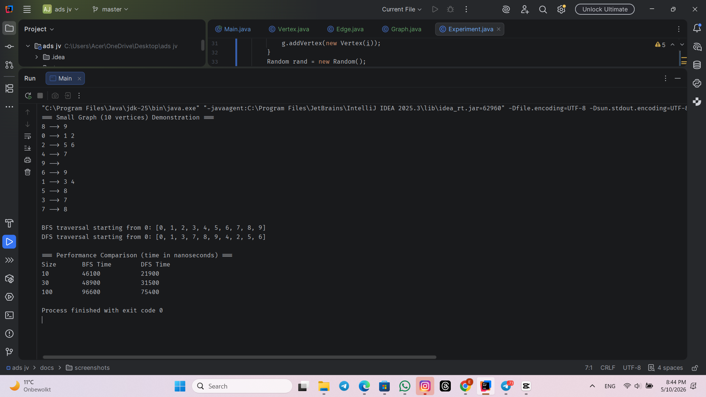
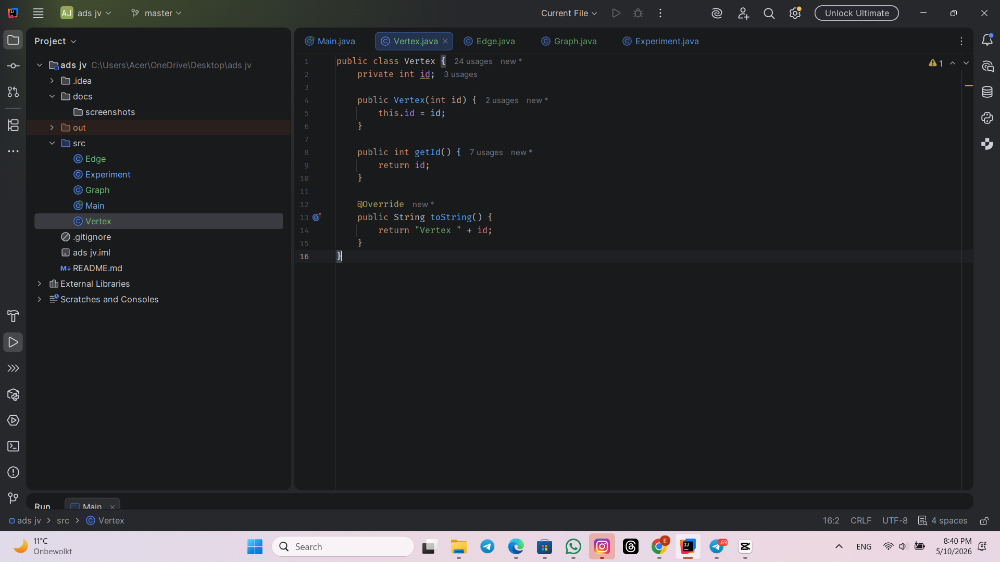
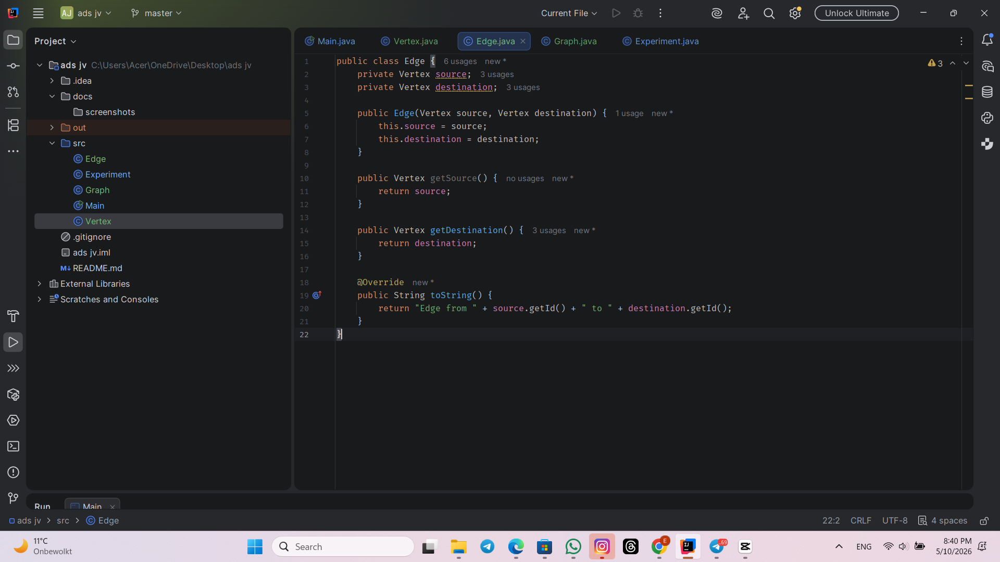
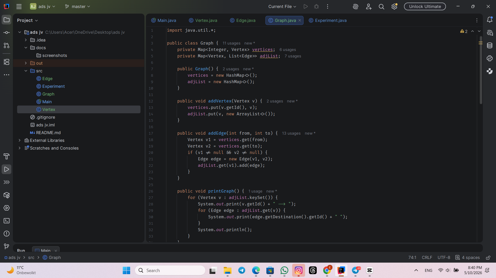
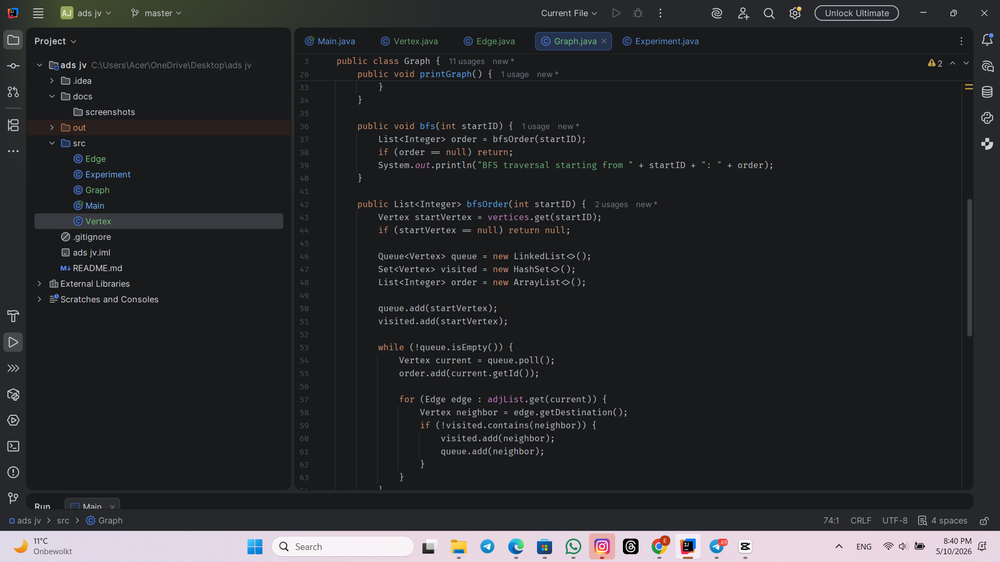
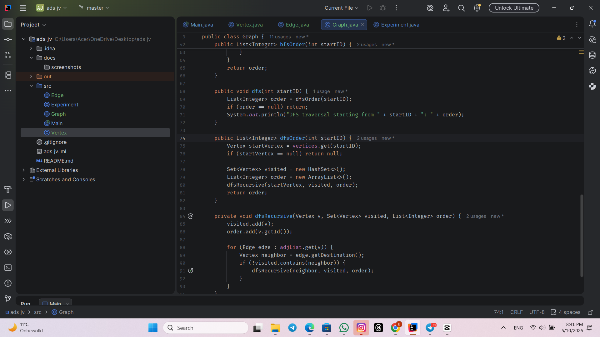
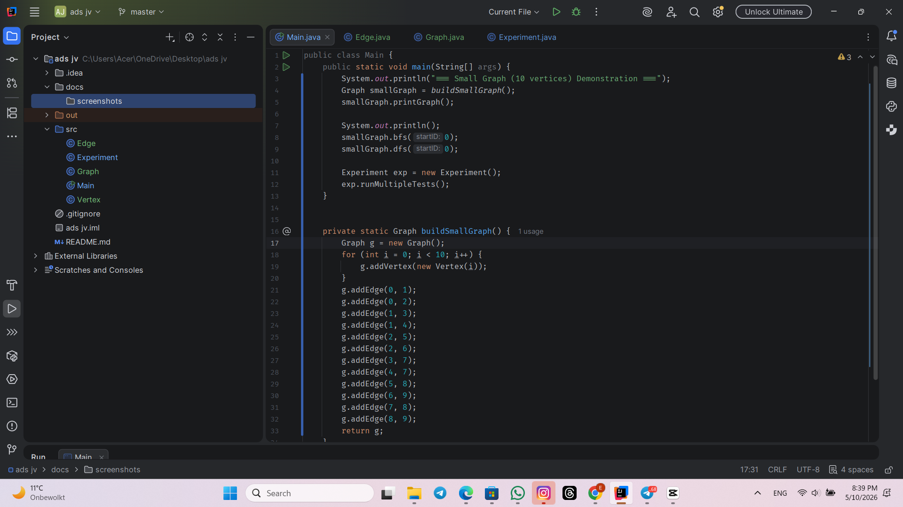
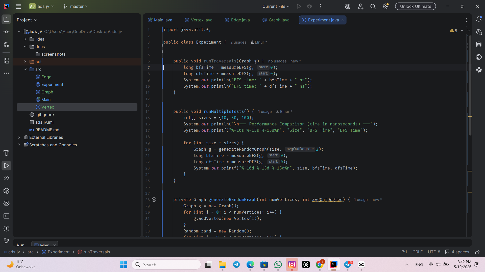
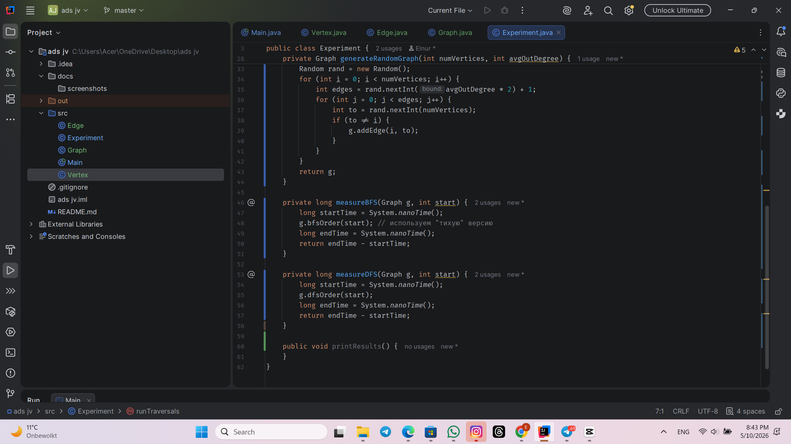

# README

Assignment 4: Graph Traversal and Representation System

I implemented BFS and DFS traversal algorithms on a graph stored as an adjacency list. I tested them on random directed graphs with 10, 30, and 100 vertices using System.nanoTime().

Here is my result:

What I learned: DFS was slightly faster because it does not use a queue. Both scale linearly with graph size, matching O(V + E) complexity. BFS is better for shortest path, DFS for deep exploration. Main challenge was separating traversal logic from time measurement.

Screenshots:

