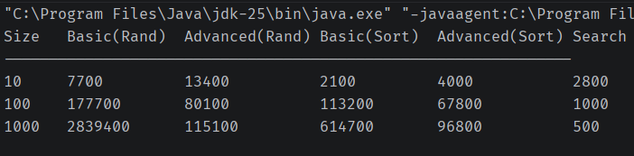
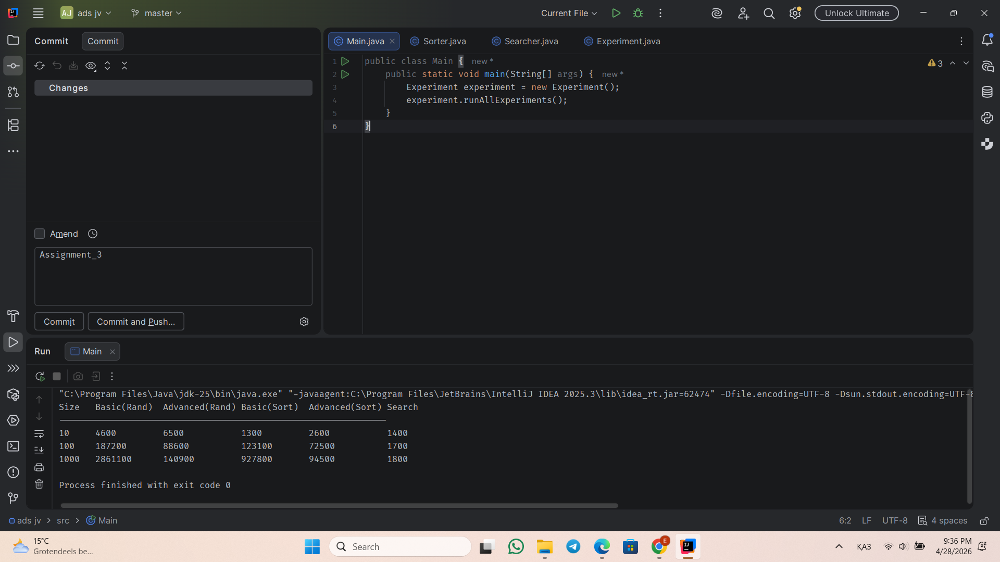
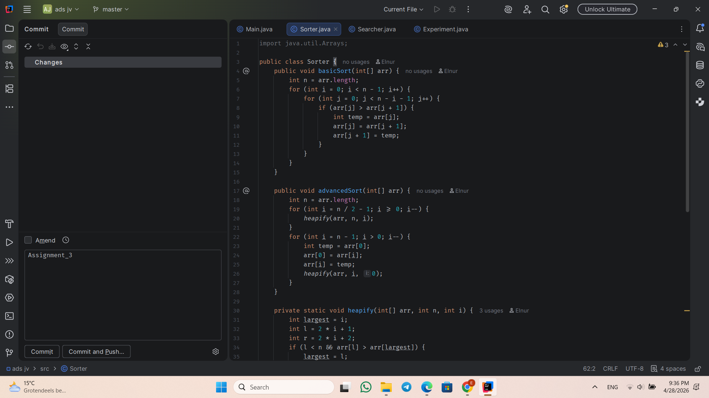
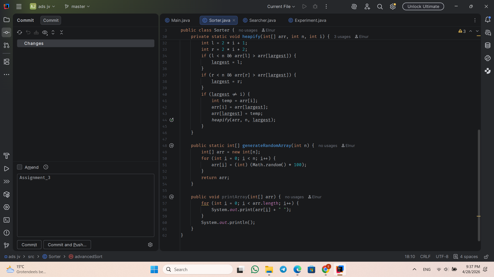
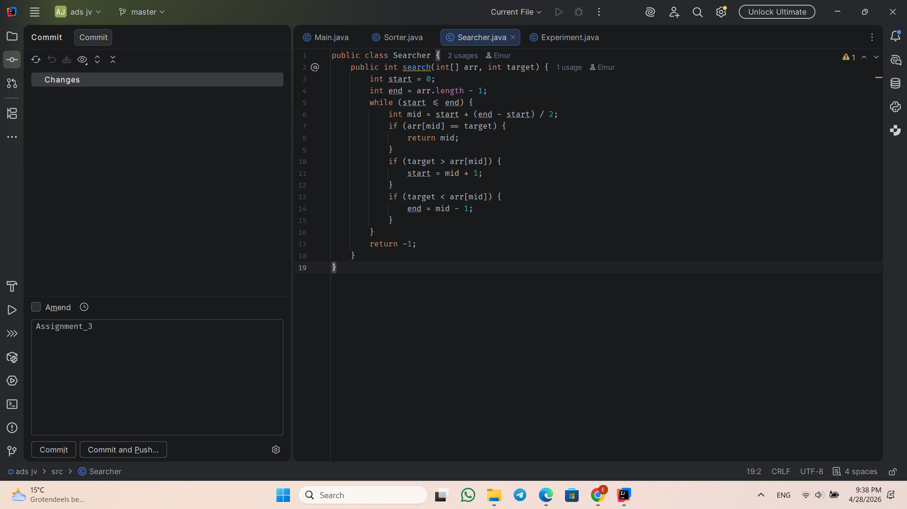
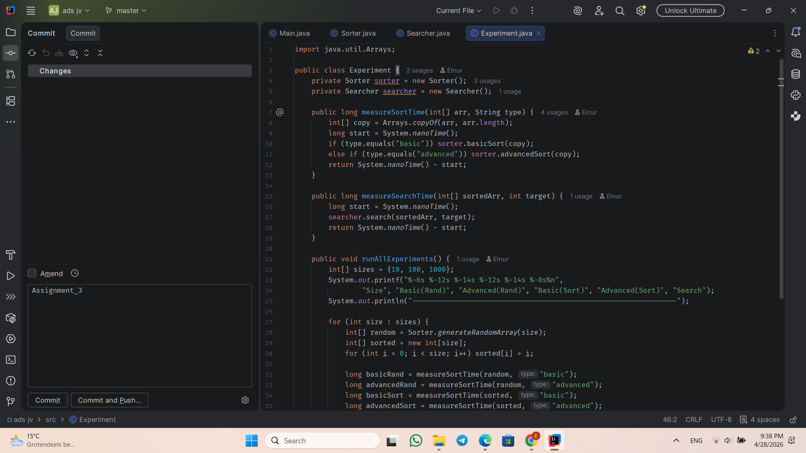
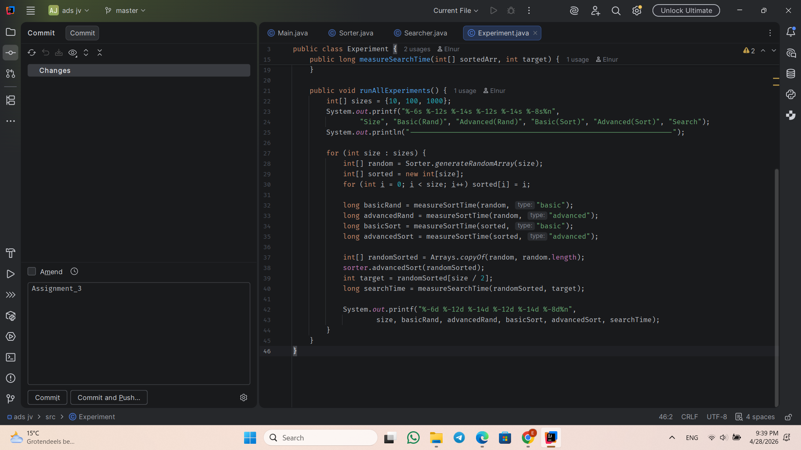

I chose three algorithms for this assignment.

Basic sorting: Bubble Sort  
Advanced sorting: Heap Sort  
Searching: Binary Search

I tested them on random and sorted arrays of sizes 10, 100, and 1000. I measured execution time using System.nanoTime().

Here is my output:

What I learned:

Heap Sort is faster than Bubble Sort, especially when the array is large. This matches O(n log n) vs O(n²). Bubble Sort works better on sorted data, but still slow. Heap Sort performs well on both random and sorted arrays.

Binary Search is very fast (O(log n)). It works only on sorted arrays because it needs to divide the search space in half.

Overall, the results match the expected Big-O complexity.

